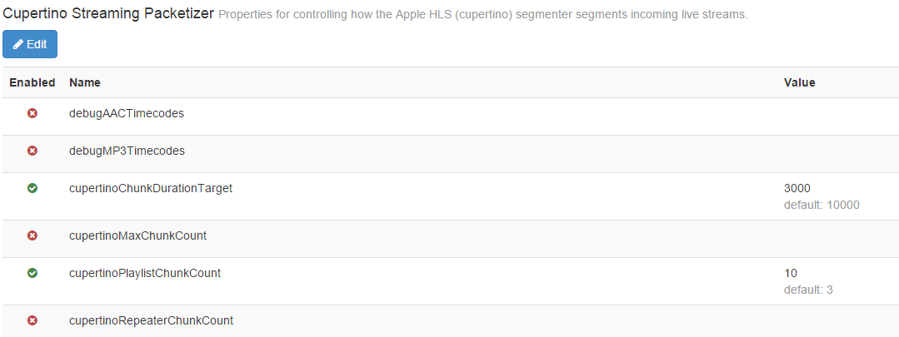
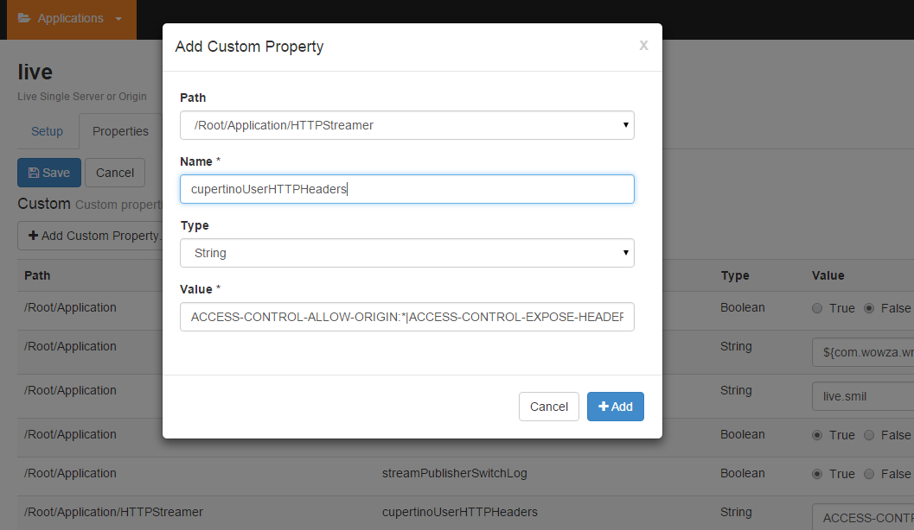

## How to optimize Wowza server for Peer5

If don't already have a running Wowza server follow one of these:

- [Getting started](https://www.wowza.com/forums/content.php?721-getting-started) with Wowza Streaming Cloud
- [Getting started](https://www.wowza.com/forums/content.php?625-How-to-get-started-as-a-Wowza-Streaming-Engine-Manager-administrator) with Wowza Streaming Engine (self hosted)

*This guide assumes HLS, although DASH will be very similar.

In order for end-users to efficiently transfer segments we’d want to configure the number of segments and segment length a bit differently than default.  
Default HLS config is 3 segments, 10 seconds long each.  
We’d like to configure it to 10 segments, 3 seconds long each instead.  
We will also add CORS. This can be done either from the UI or by editing the XML.

### __Option 1: From the Wowza UI__

a. **playlist length**  
Under your `live application > Properties > Cupertino stream packetizer`  
set `cupertinoPlaylistChunkCount` to 10

b. **segment sizes**  
Under your `live application > Properties > Cupertino stream packetizer`  
set `cupertinoChunkDurationTarget` to 3000


	
c. **CORS**
Under your `live application > Properties > Custom > Edit > Add Customer Property`:  
set `Path` to `/Root/Application/HTTPStreamer`  
set `Name` to `cupertinoUserHTTPHeaders`  
set `Type` to `String`  
set `Value` to `ACCESS-CONTROL-ALLOW-ORIGIN:*|ACCESS-CONTROL-EXPOSE-HEADERS:content-length|ACCESS-CONTROL-ALLOW-HEADERS:range`




### __Option 2: Application.xml__

It is also possible to set these values Directly in the application configuration file located at <wowza root folder>/conf/<application name>/Application.xml  
* **Make sure to backup the configuration file in case anything goes wrong**

Open the file with a text editor, In the XML under **`Root/Application/LiveStreamPacketizer/Properties`** add the following properties:

```xml
<Property>
    <Name>cupertinoChunkDurationTarget</Name>
    <Value>3000</Value>
    <Type>Integer</Type>
</Property>
<Property>
    <Name>cupertinoPlaylistChunkCount</Name>
    <Value>10</Value>
    <Type>Integer</Type>
</Property>
```

Under **`Root/Application/HTTPStreamer/Properties`** add the following property:

```xml
<Property>
    <Name>cupertinoUserHTTPHeaders</Name>
    <Value>ACCESS-CONTROL-ALLOW-ORIGIN:*|ACCESS-CONTROL-EXPOSE-HEADERS:content-length|ACCESS-CONTROL-ALLOW-HEADERS:Range</Value>
	<Type>String</Type>
</Property>
```


