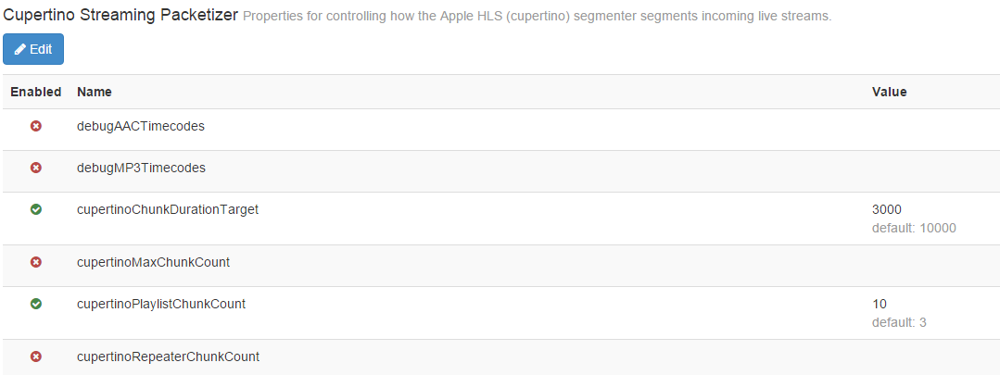
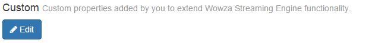
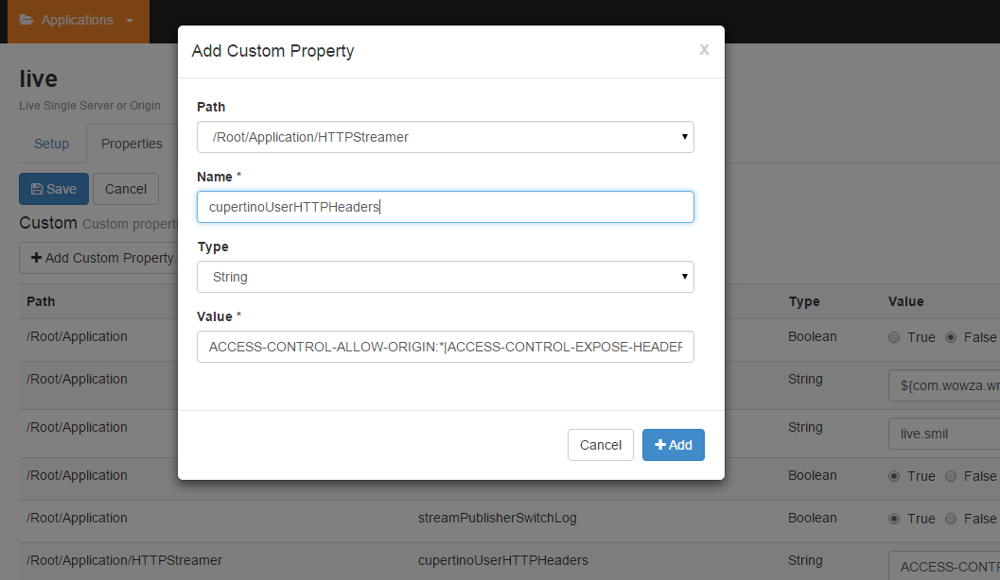

## How to optimize Wowza server for Peer5

If don't already have a running Wowza server please follow one of the following guides:

- [Getting started](https://www.wowza.com/forums/content.php?721-getting-started) with Wowza Streaming Cloud
- [Getting started](https://www.wowza.com/forums/content.php?625-How-to-get-started-as-a-Wowza-Streaming-Engine-Manager-administrator) with Wowza Streaming Engine (self hosted)

*This guide assumes HLS, DASH integration is performed in a similar fashion.

In order for end-users to efficiently transmit segments a few configuration changes are required. The default number of segments, the segment length and the number of chunks can be set to values that are friendlier to use transmission.

The default Wowza HLS configuration value is to return 3 segments in each playlist - each 10 seconds long.  
We’d like to configure it to 20 segments, 5 seconds long each instead.  
We will also add [CORS](https://docs.peer5.com/guides/cors/). This can be done either from the UI or by editing the XML.

### __Option 1: From the Wowza UI__

a. **playlist length**  
Under your `live application > Properties > Cupertino stream packetizer`  
set `cupertinoPlaylistChunkCount` to 20

b. **segment sizes**  
Under your `live application > Properties > Cupertino stream packetizer`  
set `cupertinoChunkDurationTarget` to 5000

c. **number of chunks**  
Under your `live application > Properties > Cupertino stream packetizer`  
set `cupertinoMaxChunkCount` to 30

	
c. **CORS**
Under your `live application > Properties > Custom > Edit > Add Customer Property`:  
set `Path` to `/Root/Application/HTTPStreamer`  
set `Name` to `cupertinoUserHTTPHeaders`  
set `Type` to `String`  
set `Value` to `ACCESS-CONTROL-ALLOW-ORIGIN:*|ACCESS-CONTROL-EXPOSE-HEADERS:content-length|ACCESS-CONTROL-ALLOW-HEADERS:range`







### __Option 2: Application.xml__

It is also possible to set these values Directly in the application configuration file located at <wowza root folder>/conf/<application name>/Application.xml  
* **Make sure to backup the configuration file in case anything goes wrong**

Open the file with a text editor, In the XML under **`Root/Application/LiveStreamPacketizer/Properties`** add the following properties:

```xml
<Property>
    <Name>cupertinoChunkDurationTarget</Name>
    <Value>5000</Value>
    <Type>Integer</Type>
</Property>
<Property>
    <Name>cupertinoPlaylistChunkCount</Name>
    <Value>30</Value>
    <Type>Integer</Type>
</Property>
<Property>
    <Name>cupertinoMaxChunkCount</Name>
    <Value>30</Value>
    <Type>Integer</Type>
</Property>
```

Under **`Root/Application/HTTPStreamer/Properties`** add the following property:

```xml
<Property>
    <Name>cupertinoUserHTTPHeaders</Name>
    <Value>ACCESS-CONTROL-ALLOW-ORIGIN:*|ACCESS-CONTROL-EXPOSE-HEADERS:content-length|ACCESS-CONTROL-ALLOW-HEADERS:Range</Value>
	<Type>String</Type>
</Property>
```
